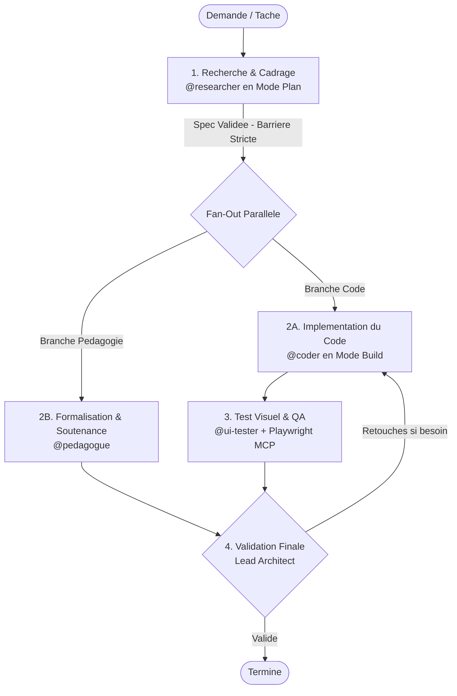

[🇬🇧 Read in English](README.md)

# Workflows Multi-Agents Compartimentes — OpenCode & Antigravity (AGY)

Ce depot propose **deux stacks d'ingenierie logicielle assistee par IA strictement compartimentees et independantes** :
1. **`workflows/opencode/`** : Stack native **OpenCode** (TUI, modele agnostique, snapshots Git `/undo` / `/redo`, commandes slash).
2. **`workflows/agy/`** : Stack native **Antigravity CLI (AGY)** (Orchestration multi-agents native Google DeepMind).

Le but fondamental de chaque workflow est d'eviter les erreurs classiques des LLMs (hallucinations d'APIs, manque de planification, code non teste, regressions silencieuses) en appliquant un cycle d'ingenierie rigoureux en 4 etapes.

---

## 1. Comment ca marche (Cycle en 4 Phases)

Chaque stack fonctionne avec un agent principal (**Lead Architect / Coordinator**) orchestrant 4 sous-agents specialises :



1. **Recherche (`@researcher`)** : Verifie la documentation officielle, inspecte les fichiers existants et cadre la tache en lecture seule. Le codeur ne demarre pas tant que ce cadrage n'est pas valide (**Barriere Sequentielle**).
2. **Implementation (`@coder`)** : Ecrit le code propre, type, modulaire et sans hallucination en suivant strictement la specification de la phase 1.
3. **Formalisation & Pedagogie (`@pedagogue`)** : Vulgarise les concepts complexes, produit la modelisation mathematique/algorithmique, les schemas Mermaid et les fiches d'oral de soutenance.
4. **Tests & QA Visuel (`@ui-tester`)** : Pilote un navigateur reel via Playwright MCP, teste les parcours et prend des captures d'ecran obligatoires (**Desktop 1200px** et **Mobile 390px**).
5. **Validation (Lead)** : Verifie le diff Git et inspecte visuellement les captures d'ecran avant de cloturer la tache.

---

## 2. Architecture Compartimentee & Deploiement

Les deux stacks sont separees dans leurs sous-dossiers dedies :

### Deploiement Rapide avec le Script Racine :
```bash
# Deploiement OpenCode
./setup.sh opencode                     # dans le dossier courant
./setup.sh opencode /chemin/vers/projet # dans un projet cible
./setup.sh opencode --global            # globalement dans ~/.config/opencode/

# Deploiement Antigravity (AGY)
./setup.sh agy                          # dans le dossier courant
./setup.sh agy /chemin/vers/projet      # dans un projet cible
./setup.sh agy --global                 # globalement dans ~/.gemini/config/

# Menu interactif
./setup.sh
```

### Deploiement Direct depuis les Dossiers de Workflow :
- **OpenCode** : `./workflows/opencode/setup_opencode.sh [DOSSIER_CIBLE]`
- **Antigravity (AGY)** : `./workflows/agy/setup_agents.sh [DOSSIER_CIBLE]`

---

## 3. Demarrage des Sessions

- **Sous OpenCode** :
  ```bash
  cd /chemin/vers/projet && opencode
  ```
  *Basculez entre le Mode Plan et le Mode Build avec `<Tab>`. Utilisez `/undo` ou `/redo` pour voyager dans le temps via les snapshots Git.*

- **Sous Antigravity (AGY)** :
  ```bash
  cd /chemin/vers/projet && agy
  ```
  *Utilisez `/goal <mission>` pour lancer l'execution autonome supervisée.*

---

## 4. Competences d'Amelioration Continue (Cycle "Learn")

Chaque stack dispose de commandes dediees pour l'introspection et la distillation :

- **`/learn-local`** : 
  - Met a jour automatiquement le sous-module de documentation (`git submodule update --remote docs/opencode`).
  - Analyse les logs de session/conversation pour detecter les frictions et erreurs d'outils.
  - Adapte les invites des sous-agents locaux et la configuration du projet.
- **`/learn-global`** :
  - Met a jour `docs/opencode`.
  - Analyse les evolutions locales avec verification anti-fuite (suppression des secrets et chemins absolus).
  - Synchronise les ameliorations universelles vers le dossier correspondant (`workflows/opencode/` ou `workflows/agy/`).

---

## 5. Structure Compartimentee du Depot

```text
workflow/
├── workflows/
│   ├── agy/                                      # Stack Antigravity CLI (AGY) dediee
│   │   ├── .agents/
│   │   │   ├── agents/                           # coder, researcher, ui-tester, pedagogue
│   │   │   ├── skills/                           # learn-local, learn-global
│   │   │   └── mcp_config.json                   # Configuration Playwright MCP
│   │   ├── AGENTS.md                             # Protocole de gouvernance Agy
│   │   ├── documentation_agy.md                  # Manuel technique complet Agy
│   │   └── setup_agents.sh                       # Script de deploiement Agy
│   │
│   └── opencode/                                 # Stack OpenCode dediee
│       ├── .opencode/
│       │   ├── opencode.json                     # Configuration OpenCode (schema officiel)
│       │   ├── AGENTS.md                         # Protocole de gouvernance OpenCode
│       │   ├── agents/                           # coder.md, researcher.md, etc.
│       │   ├── command/                          # /learn-local.md, /learn-global.md
│       │   └── skills/                           # Scripts python d'introspection & distillation
│       ├── opencode.json                         # Miroir configuration racine OpenCode
│       ├── documentation_opencode.md             # Manuel technique complet OpenCode
│       └── setup_opencode.sh                     # Script de deploiement OpenCode
│
├── docs/
│   └── opencode/                                 # [Git Submodule] Documentation officielle OpenCode
├── scripts/
│   └── verify_dual_stack.py                      # Suite de tests et validation d'integrite
├── setup.sh                                      # Script d'installation racine universel
├── .gitmodules                                   # Enregistrement du sous-module docs/opencode
├── .gitignore
├── LICENSE
├── README.fr.md                                  # Documentation francaise
└── README.md                                     # English documentation (default)
```

---

## 6. Outils & Prerequis

- **Node.js & npx** : Fait tourner le serveur Playwright MCP (`@executeautomation/playwright-mcp-server`).
- **OpenCode** : Installe via `curl -fsSL https://opencode.ai/install | bash`.
- **Antigravity CLI (agy)** : CLI agentique Google DeepMind.
- **Python 3** : Scripts d'analyse de session et distillation.
