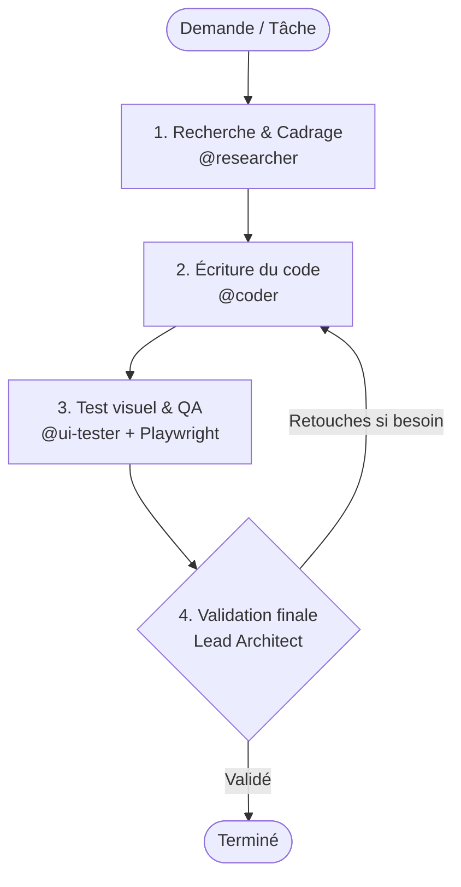

[🇬🇧 Read in English](README.md)

# Workflow Multi-Agents — Antigravity CLI (AGY)

Configuration et scripts d'orchestration pour structurer le développement assisté par IA avec **Antigravity CLI (AGY)**.

Le but de ce workflow est d'éviter les erreurs classiques des LLMs (hallucinations d'APIs, manque de planification, code non testé) en appliquant un cycle de travail rigoureux en 4 étapes.

---

### Comment ça marche

Le système fonctionne avec un agent principal (**Lead Architect**) qui pilote 3 sous-agents spécialisés :



1. **Recherche (`@researcher`)** : Vérifie la documentation officielle, inspecte les fichiers existants et cadre la tâche. Le codeur ne démarre pas tant que ce cadrage n'est pas validé.
2. **Implémentation (`@coder`)** : Écrit le code propre, typé et modulaire en suivant strictement le plan de la phase 1.
3. **Tests & QA (`@ui-tester`)** : Ouvre un vrai navigateur via Playwright MCP, teste les parcours et prend des captures d'écran (Desktop 1200px et Mobile 390px).
4. **Validation (Lead Architect)** : Vérifie le code et inspecte visuellement les captures d'écran avant de valider la tâche.

---

### Installation & Utilisation

Le script `setup_agents.sh` permet d'installer facilement les agents et la configuration dans n'importe quel projet ou sur la machine :

```bash
# Rendre le script exécutable
chmod +x setup_agents.sh

# Installer dans le dossier courant
./setup_agents.sh

# Installer dans un autre dossier de projet
./setup_agents.sh /chemin/vers/projet

# Installer globalement dans ~/.gemini/config/
./setup_agents.sh --global
```

---

### Structure du dépôt

```text
workflow/
├── .agents/
│   ├── agents/
│   │   ├── coder/agent.md        # Prompt et outils du sous-agent Coder
│   │   ├── researcher/agent.md   # Prompt et outils du sous-agent Researcher
│   │   └── ui-tester/agent.md    # Prompt et outils du sous-agent UI-Tester
│   └── mcp_config.json           # Config MCP pour Playwright
├── AGENTS.md                     # Règles de gouvernance et détails des 4 phases
├── documentation_agy.md          # Doc de référence Antigravity CLI
├── setup_agents.sh               # Script d'installation automatique
├── .gitignore
├── LICENSE
├── README.fr.md                  # Documentation en français
└── README.md                     # English documentation (default)
```

---

### Outils & Prérequis

- **Node.js & npx** : Utilisé pour faire tourner le serveur MCP Playwright (`@executeautomation/playwright-mcp-server`) sans installation lourde.
- **Antigravity CLI (agy)** : CLI d'agentique Google DeepMind.
- **Python 3** : Utilisé pour les serveurs locaux de test.
