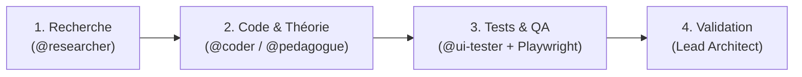

[🇬🇧 Read in English](README.md)

# Workflow Multi-Agents pour l'IA

Un système multi-agents structuré pour éliminer les erreurs courantes du code généré par IA (hallucinations d'APIs, manque de cadrage, code non testé) grâce à un cycle d'ingénierie rigoureux en 4 étapes.

Compatible avec deux environnements indépendants : **OpenCode** et **Antigravity CLI (AGY)**.

---

### Comment ça marche

Un agent principal (**Lead Coordinator**) pilote des sous-agents spécialisés de manière séquentielle :



1. **Recherche (`@researcher`)** : Analyse la documentation et la base de code en lecture seule. L'écriture du code est bloquée tant que ce cadrage n'est pas validé.
2. **Implémentation (`@coder` / `@pedagogue`)** : Écrit du code propre et typé ou modélise l'architecture sans inventer d'APIs ni de dépendances.
3. **Tests & QA Visuel (`@ui-tester`)** : Pilote un navigateur réel via Playwright MCP et capture les écrans (Desktop 1200px et Mobile 390px).
4. **Validation (Lead)** : Vérifie le diff Git et les captures d'écran avant de clôturer la tâche.

---

### Démarrage rapide

```bash
# Lancer l'installateur interactif
./setup.sh

# Ou installer directement :
./setup.sh opencode     # Stack OpenCode
./setup.sh agy          # Stack Antigravity
./setup.sh agy --global # Installation globale dans ~/.gemini/config/
```

---

### Structure du dépôt

```text
workflow/
├── workflows/
│   ├── opencode/      # Stack OpenCode (config, agents, skills)
│   └── agy/           # Stack Antigravity CLI (agents, config MCP, docs)
├── docs/opencode/     # Documentation officielle OpenCode (sous-module)
├── setup.sh           # Script d'installation universel
└── LICENSE            # Licence MIT
```

---

### Auteur & Licence

- **Auteur** : [Natéo Gadaix](https://github.com/lyko27) ([Portfolio](https://perso.isima.fr/~nagadaix/) • [LinkedIn](https://www.linkedin.com/in/nat%C3%A9o-gadaix-7507a0383/))
- **Licence** : [MIT](LICENSE)
