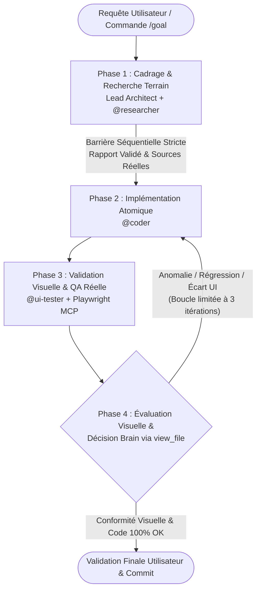

# Antigravity Multi-Agent Workflow & Orchestration Engine 🤖🚀

<div align="center">

[](https://github.com/lyko27/worflow-AI)
[-black?style=flat-square&logo=terminal)](https://github.com/lyko27/worflow-AI)
[](AGENTS.md)
[](.agents/mcp_config.json)
[](LICENSE)

**Workflow d'ingénierie logicielle assistée par IA et d'orchestration multi-agents autonome pour Antigravity CLI (AGY).**

[Architecture](#-architecture-globale--lead-architect--subagents) • [Protocole 4 Phases](#-protocole-strict-en-4-phases) • [Rôles des Agents](#-rôles--responsabilités-des-agents) • [Déploiement](#-installation--déploiement-rapide) • [Structure du Dépôt](#-structure-des-fichiers)

</div>

---

## 📌 Présentation

Ce dépôt contient un **cadre d'orchestration multi-agents robuste et portable** conçu pour piloter le développement logiciel automatisé avec **Antigravity CLI (AGY)**.

Face aux limites courantes du code généré par IA (hallucinations d'APIs, manque de planification, validation superficielle sur de simples codes de retour HTTP 200), ce système introduit une **gouvernance stricte en 4 phases avec barrière séquentielle** et un outillage d'inspection visuelle réelle via un serveur **Model Context Protocol (MCP) Playwright**.

---

## 🏛️ Architecture Globale : Lead Architect + Subagents

Le système repose sur un modèle d'orchestration hiérarchique où l'agent principal agit comme **Lead Architect (Brain)** et délègue l'exécution à des sous-agents spécialisés :



---

## 👥 Rôles & Responsabilités des Agents

| Agent | Type / Emplacement | Responsabilités & Capacités Clés |
| :--- | :--- | :--- |
| 🧠 **Lead Architect** *(Brain)* | Agent Principal | Orchestration séquentielle, validation des spécifications, interdiction de coder sans plan, inspection visuelle obligatoire des captures réelles via `view_file`, arbitrage final. |
| 🔍 **`@researcher`** | `.agents/agents/researcher/` | Exploration de la documentation officielle, benchmarking d'écosystèmes réels, analyse statique de dépôts de code et règles anti-hallucination. |
| 💻 **`@coder`** | `.agents/agents/coder/` | Implémentation de code propre, typé et modulaire, clean code, tests unitaires, respect strict du périmètre défini par le Lead Architect. |
| 👁️ **`@ui-tester`** *(Eyes)* | `.agents/agents/ui-tester/` | Navigation automatisée Playwright MCP, captures multi-résolution obligatoires (**Desktop 1200px** & **Mobile 390px**), surveillance des exceptions console et du réseau. |

---

## 🔒 Principes Directeurs & Garde-Fous

1. **Barrière de Synchronisation Séquentielle** : L'implémentation (`@coder`) ne démarre **JAMAIS** en parallèle ou avant la validation complète du rapport de cadrage (`@researcher`).
2. **Garde-fous Anti-Hallucination & Vérité Terrain** : Interdiction formelle d'inventer des APIs, librairies ou dépendances fictives. Toutes les spécifications s'appuient sur des données vérifiées et la codebase réelle.
3. **Validation Visuelle Réelle & Multi-Écran** : Ne jamais valider une tâche sur de simples statuts HTTP 200. Inspection visuelle obligatoire des captures d'écran Desktop et Mobile par le Lead Architect.
4. **Autonomie de bout en bout (Mode Manager)** : Exécution fluide et enchaînée des 4 phases en autonomie, avec synthèse claire et preuves pour la validation utilisateur finale.

---

## 🚀 Installation & Déploiement Rapide

Le script exécutable [`setup_agents.sh`](setup_agents.sh) permet d'initialiser, mettre à jour ou déployer l'architecture multi-agents dans n'importe quel projet ou globalement sur la machine :

```bash
# 1. Rendre le script exécutable (si nécessaire)
chmod +x setup_agents.sh

# 2. Déploiement dans le projet courant
./setup_agents.sh

# 3. Déploiement dans un projet externe spécifique
./setup_agents.sh /chemin/vers/mon-autre-projet

# 4. Déploiement global pour tous les projets (~/.gemini/config/)
./setup_agents.sh --global

# 5. Déploiement des fichiers seuls (sans toucher aux settings IDE)
./setup_agents.sh --no-settings
```

---

## 📂 Structure des Fichiers

```
workflow/
├── .agents/
│   ├── agents/
│   │   ├── coder/
│   │   │   └── agent.md        # Définition & prompt système du sous-agent Coder
│   │   ├── researcher/
│   │   │   └── agent.md        # Définition & prompt système du sous-agent Researcher
│   │   └── ui-tester/
│   │       └── agent.md        # Définition & prompt système du sous-agent UI-Tester
│   └── mcp_config.json         # Configuration du serveur Playwright MCP
├── AGENTS.md                   # Protocole de gouvernance et règles des 4 phases
├── documentation_agy.md        # Guide exhaustif et spécifications Antigravity CLI
├── setup_agents.sh             # Script d'installation et de déploiement portable
├── .gitignore                  # Exclusion des fichiers temporaires, logs et screenshots
├── LICENSE                     # Licence MIT
└── README.md                   # Présentation générale du workflow
```

---

## 🛠️ Configuration Model Context Protocol (MCP)

Le serveur Playwright MCP est configuré dans `.agents/mcp_config.json` et s'exécute automatiquement via `npx` sans installation globale lourde :

```json
{
  "mcpServers": {
    "playwright": {
      "command": "npx",
      "args": [
        "-y",
        "@executeautomation/playwright-mcp-server"
      ]
    }
  }
}
```

---

## 👤 Auteur

**Natéo Gadaix** — Élève-Ingénieur en Informatique @ [ISIMA](https://www.isima.fr/) (Clermont Auvergne INP)  
- 💼 **LinkedIn :** [Natéo Gadaix](https://www.linkedin.com/in/nat%C3%A9o-gadaix-7507a0383/)  
- 🌐 **Portfolio :** [perso.isima.fr/~nagadaix](https://perso.isima.fr/~nagadaix/)  
- 🐙 **GitHub :** [@lyko27](https://github.com/lyko27)

---

## 📄 Licence

Ce projet est sous licence [MIT](LICENSE).
