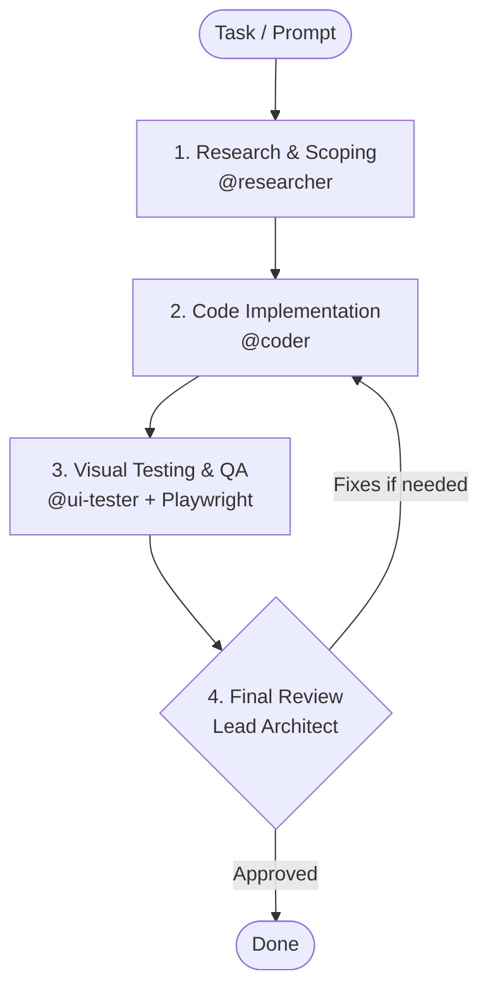

[🇫🇷 Lire en français](README.fr.md)

# Multi-Agent Workflow — Antigravity CLI (AGY)

Configuration and orchestration scripts to structure AI-assisted software development using **Antigravity CLI (AGY)**.

The goal of this workflow is to prevent common LLM pitfalls (hallucinated APIs, lack of planning, untested code) by enforcing a strict 4-step engineering cycle.

---

### How It Works

The workflow uses a main agent (**Lead Architect**) orchestrating 3 specialized subagents:



1. **Research (`@researcher`)**: Inspects existing project files and checks official documentation before any code is written. The coder will not start until this research is validated.
2. **Implementation (`@coder`)**: Writes clean, typed, modular code strictly following the phase 1 specification.
3. **Tests & QA (`@ui-tester`)**: Runs real browser sessions via Playwright MCP, tests user flows, and takes screenshots (Desktop 1200px and Mobile 390px).
4. **Validation (Lead Architect)**: Inspects code changes and visual screenshots before completing the task.

---

### Setup & Usage

The `setup_agents.sh` script installs the agents and MCP configuration into any project directory or globally:

```bash
# Make script executable
chmod +x setup_agents.sh

# Install in current directory
./setup_agents.sh

# Install in another project directory
./setup_agents.sh /path/to/project

# Install globally in ~/.gemini/config/
./setup_agents.sh --global
```

---

### Repository Structure

```text
workflow/
├── .agents/
│   ├── agents/
│   │   ├── coder/agent.md        # System prompt & tools for Coder subagent
│   │   ├── researcher/agent.md   # System prompt & tools for Researcher subagent
│   │   └── ui-tester/agent.md    # System prompt & tools for UI-Tester subagent
│   └── mcp_config.json           # Playwright MCP server configuration
├── AGENTS.md                     # Governance protocol and 4-phase details
├── documentation_agy.md          # Antigravity CLI reference documentation
├── setup_agents.sh               # Automated deployment script
├── .gitignore
├── LICENSE
├── README.fr.md                  # French documentation
└── README.md                     # English documentation (default)
```

---

### Tools & Prerequisites

- **Node.js & npx**: Runs the Playwright MCP server (`@executeautomation/playwright-mcp-server`) on demand.
- **Antigravity CLI (agy)**: Google DeepMind agentic CLI.
- **Python 3**: Used for local test servers.
