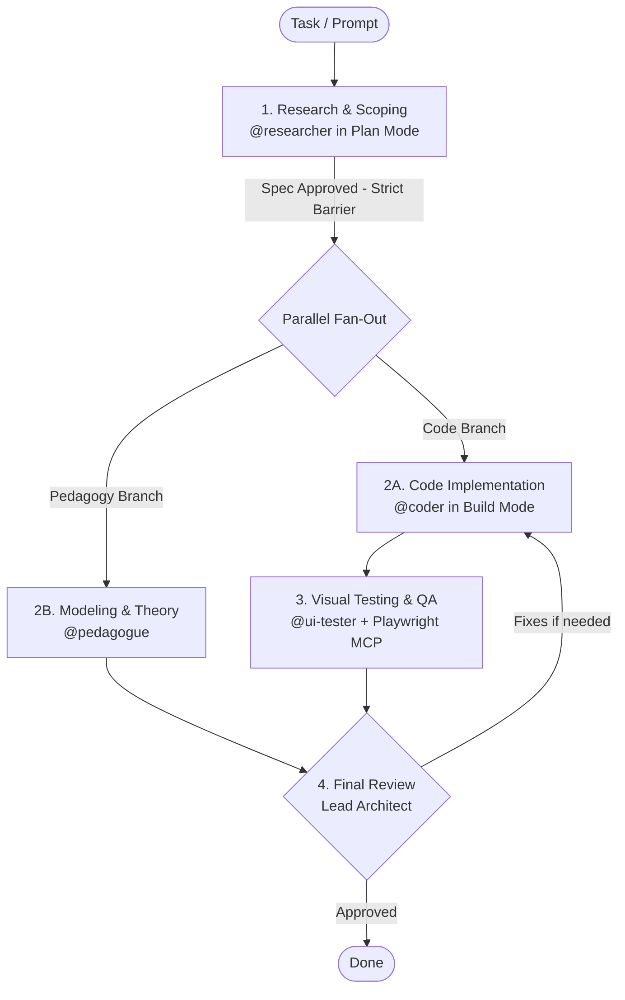

[🇫🇷 Lire en français](README.fr.md)

# Compartmentalized Multi-Agent Workflows — OpenCode & Antigravity (AGY)

This repository provides **two strictly compartmentalized, independent AI software engineering stacks**:
1. **`workflows/opencode/`**: Native **OpenCode** stack (terminal TUI, model agnostic, Git `/undo` / `/redo` snapshots, slash commands).
2. **`workflows/agy/`**: Native **Antigravity CLI (AGY)** stack (Google DeepMind agentic multi-agent orchestration).

The primary mission of both workflows is to prevent standard LLM pitfalls (API hallucinations, lack of planning, untested code, silent regressions) by enforcing a strict 4-step engineering lifecycle.

---

## 1. How It Works (4-Phase Cycle)

Each stack is driven by a main agent (**Lead Architect / Coordinator**) supervising 4 specialized subagents:



1. **Research (`@researcher`)**: Inspects official documentation and codebase in read-only mode. Coding is forbidden until this research is approved (**Sequential Barrier**).
2. **Implementation (`@coder`)**: Writes clean, typed, modular code without hallucination, strictly adhering to the Phase 1 specification.
3. **Formalization & Pedagogy (`@pedagogue`)**: Explains complex concepts, provides formal mathematical/algorithmic models, Mermaid architecture diagrams, and oral defense presentations.
4. **Visual Testing & QA (`@ui-tester`)**: Pilots a real browser via Playwright MCP, tests interactions, and captures mandatory screenshots (**Desktop 1200px** and **Mobile 390px**).
5. **Validation (Lead)**: Reviews Git diffs and inspects screenshots before marking the task complete.

---

## 2. Compartmentalized Architecture & Deployment

Both stacks are isolated into their dedicated directories:

### Quick Deployment via Root Script:
```bash
# OpenCode deployment
./setup.sh opencode                     # in current directory
./setup.sh opencode /path/to/project    # in a specific target project
./setup.sh opencode --global            # globally in ~/.config/opencode/

# Antigravity (AGY) deployment
./setup.sh agy                          # in current directory
./setup.sh agy /path/to/project         # in a specific target project
./setup.sh agy --global                 # globally in ~/.gemini/config/

# Interactive menu
./setup.sh
```

### Direct Deployment from Workflow Folders:
- **OpenCode**: `./workflows/opencode/setup_opencode.sh [TARGET_DIR]`
- **Antigravity (AGY)**: `./workflows/agy/setup_agents.sh [TARGET_DIR]`

---

## 3. Launching Sessions

- **With OpenCode**:
  ```bash
  cd /path/to/project && opencode
  ```
  *Switch between Plan Mode and Build Mode with `<Tab>`. Use `/undo` and `/redo` to time-travel through Git snapshots.*

- **With Antigravity (AGY)**:
  ```bash
  cd /path/to/project && agy
  ```
  *Use `/goal <prompt>` to run autonomous supervised missions.*

---

## 4. Continuous Learning Skills ("Learn" Cycle)

Each stack has dedicated commands for introspection and distillation:

- **`/learn-local`**:
  - Automatically synchronizes the official OpenCode doc submodule (`git submodule update --remote docs/opencode`).
  - Analyzes session logs to detect tool failures and user corrections.
  - Adapts local subagent prompts and project configurations.
- **`/learn-global`**:
  - Automatically synchronizes `docs/opencode`.
  - Runs leak-detection scans (strips secrets, tokens, and absolute paths).
  - Distills and syncs universal improvements back to the respective workflow directory (`workflows/opencode/` or `workflows/agy/`).

---

## 5. Compartmentalized Repository Structure

```text
workflow/
├── workflows/
│   ├── agy/                                      # Dedicated Antigravity CLI (AGY) Stack
│   │   ├── .agents/
│   │   │   ├── agents/                           # coder, researcher, ui-tester, pedagogue
│   │   │   ├── skills/                           # learn-local, learn-global
│   │   │   └── mcp_config.json                   # Playwright MCP configuration
│   │   ├── AGENTS.md                             # Agy governance protocol
│   │   ├── documentation_agy.md                  # Comprehensive Agy reference guide
│   │   └── setup_agents.sh                       # Agy setup script
│   │
│   └── opencode/                                 # Dedicated OpenCode Stack
│       ├── .opencode/
│       │   ├── opencode.json                     # OpenCode configuration (official schema)
│       │   ├── AGENTS.md                         # OpenCode governance protocol
│       │   ├── agents/                           # coder.md, researcher.md, etc.
│       │   ├── command/                          # /learn-local.md, /learn-global.md
│       │   └── skills/                           # Python introspection & distillation scripts
│       ├── opencode.json                         # Root mirror OpenCode configuration
│       ├── documentation_opencode.md             # Comprehensive OpenCode reference guide
│       └── setup_opencode.sh                     # OpenCode setup script
│
├── docs/
│   └── opencode/                                 # [Git Submodule] Official OpenCode documentation
├── scripts/
│   └── verify_dual_stack.py                      # Integrity test suite
├── setup.sh                                      # Universal root setup script
├── .gitmodules                                   # Definition of docs/opencode submodule
├── .gitignore
├── LICENSE
├── README.fr.md                                  # French documentation
└── README.md                                     # English documentation (default)
```

---

## 6. Tools & Prerequisites

- **Node.js & npx**: Runs Playwright MCP (`@executeautomation/playwright-mcp-server`).
- **OpenCode**: Installed via `curl -fsSL https://opencode.ai/install | bash`.
- **Antigravity CLI (agy)**: Google DeepMind agentic CLI.
- **Python 3**: For test servers and workflow analysis scripts.
