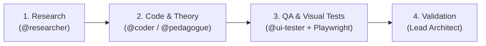

[🇫🇷 Lire en français](README.fr.md)

# Multi-Agent AI Workflow

A structured multi-agent system designed to prevent common LLM coding pitfalls (API hallucinations, lack of planning, untested code) by enforcing a strict 4-step engineering cycle.

Supports two independent stacks: **OpenCode** and **Antigravity CLI (AGY)**.

---

### How It Works

A **Lead Coordinator** manages tasks across specialized subagents sequentially:



1. **Research (`@researcher`)**: Inspects documentation and the codebase in read-only mode. Code editing is blocked until research is validated.
2. **Implementation (`@coder` / `@pedagogue`)**: Writes clean, typed code or produces conceptual models without hallucinating dependencies.
3. **QA & Visual Testing (`@ui-tester`)**: Runs real browser sessions via Playwright MCP and captures mandatory screenshots (Desktop 1200px and Mobile 390px).
4. **Validation (Lead)**: Reviews Git diffs and visual proofs before completing the task.

---

### Quick Start

```bash
# Launch interactive installer
./setup.sh

# Or install directly:
./setup.sh opencode     # OpenCode stack
./setup.sh agy          # Antigravity stack
./setup.sh agy --global # Install globally in ~/.gemini/config/
```

---

### Repository Structure

```text
workflow/
├── workflows/
│   ├── opencode/      # OpenCode stack (config, agents, skills)
│   └── agy/           # Antigravity CLI stack (agents, MCP config, docs)
├── docs/opencode/     # OpenCode documentation (submodule)
├── setup.sh           # Root installation script
└── LICENSE            # MIT License
```

---

### Author & License

- **Author**: [Natéo Gadaix](https://github.com/lyko27) ([Portfolio](https://perso.isima.fr/~nagadaix/) • [LinkedIn](https://www.linkedin.com/in/nat%C3%A9o-gadaix-7507a0383/))
- **License**: [MIT](LICENSE)
