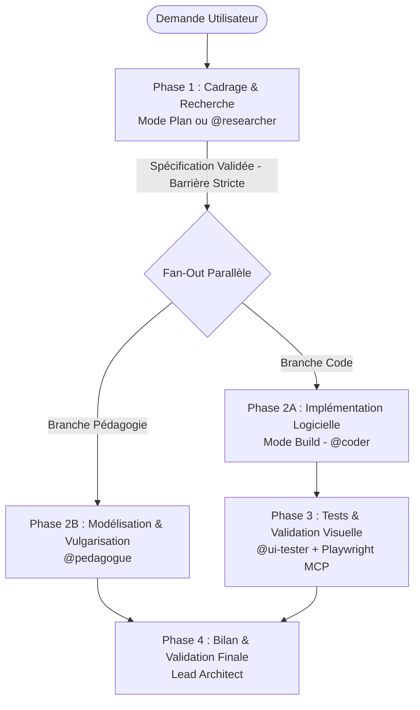

# OpenCode CLI — Guide Technique & Architecture Multi-Agents

> **Framework** : OpenCode  
> **Dépôt** : `lyko27/worflow-AI`  
> **Mode de déploiement** : Dual-Stack étanche (OpenCode + Antigravity CLI)

---

## Sommaire

1. [Introduction à OpenCode](#1-introduction-à-opencode)
2. [Comparatif & Coexistence avec Antigravity (AGY)](#2-comparatif--coexistence-avec-antigravity-agy)
3. [Arborescence du Workflow OpenCode](#3-arborescence-du-workflow-opencode)
4. [Sous-Module de Documentation Officielle](#4-sous-module-de-documentation-officielle)
5. [Configuration Principale (`opencode.json`)](#5-configuration-principale-opencodejson)
6. [Protocole de Gouvernance & Orchestration 4 Phases](#6-protocole-de-gouvernance--orchestration-4-phases)
7. [Cartographie des Sous-Agents Spécialisés](#7-cartographie-des-sous-agents-spécialisés)
8. [Commandes Slash & Cycle "Learn"](#8-commandes-slash--cycle-learn)
9. [Gestion des Permissions & Sécurité](#9-gestion-des-permissions--sécurité)
10. [Intégration MCP Playwright (QA Visuelle)](#10-intégration-mcp-playwright-qa-visuelle)
11. [Guide de Démarrage & Déploiement Portable](#11-guide-de-démarrage--déploiement-portable)

---

## 1. Introduction à OpenCode

**OpenCode** est un agent de codage IA terminal-natif (TUI) conçu pour les développeurs privilégiant la ligne de commande, la modularité des modèles LLM et l'intégration étroite avec Git.

### Points Forts :
- **Terminal-Native** : Interface TUI réactive et ergonomique, accessible en local ou via SSH.
- **Indépendance vis-à-vis des Fournisseurs (Agnostique)** : Fonctionne de façon transparente avec Anthropic, OpenAI, Google Gemini, Ollama, DeepSeek, Groq, etc.
- **Voyage dans le Temps Git (`/undo`, `/redo`)** : Chaque action de modification crée un snapshot réversible immédiatement sans perte d'historique.
- **Architecture Multi-Agents Native** : Bascule instantanée entre modes primaires (`Plan Mode` et `Build Mode` via `<Tab>`) et délégation granulaire à des sous-agents via `@nom_agent`.
- **Extensibilité MCP & Plugins** : Prise en charge native du protocole Model Context Protocol (MCP) et des commandes personnalisées Markdown.

---

## 2. Comparatif & Coexistence avec Antigravity (AGY)

Le présent dépôt implémente une coexistence stricte à tolérance zéro entre Agy et OpenCode :

| Critère | Antigravity CLI (AGY) | OpenCode | Coexistence dans ce Dépôt |
| :--- | :--- | :--- | :--- |
| **Dossier de Configuration** | `.agents/` + `AGENTS.md` | `.opencode/` + `.opencode/opencode.json` | Totalement isolés dans leurs dossiers respectifs |
| **Fichier de Règles** | `AGENTS.md` (racine) | `.opencode/AGENTS.md` (et racine) | Les deux sont maintenus synchronisés |
| **Sous-Agents** | `.agents/agents/<name>/agent.md` | `.opencode/agents/<name>.md` | Transposés 1:1 avec les permissions natives |
| **Skills / Commandes** | `.agents/skills/<name>/SKILL.md` | `.opencode/command/<name>.md` | Commandes slash OpenCode avec auto-sync doc |
| **Annulation des Modifications** | Gestion de checkpoints Agy | `/undo` et `/redo` basés sur snapshots Git | Natif dans chaque outil |
| **Script d'Initialisation** | `./setup_agents.sh` | `./setup_opencode.sh` | `./setup_all.sh` permet de choisir ou combiner |

---

## 3. Arborescence du Workflow OpenCode

L'architecture OpenCode dans le projet se déploie dans `.opencode/` :

```text
.opencode/
├── opencode.json                                 # Configuration principale (schéma officiel opencode.ai)
├── AGENTS.md                                     # Protocole de gouvernance et rôles
├── agents/                                       # Définitions modulaires des sous-agents
│   ├── coder.md                                  # Sous-agent Coder (mode: subagent, modèle pro)
│   ├── researcher.md                             # Sous-agent Researcher (mode: subagent, modèle flash)
│   ├── ui-tester.md                              # Sous-agent UI-Tester (mode: subagent, Playwright MCP)
│   └── pedagogue.md                              # Sous-agent Pédagogue (mode: subagent, modèle pro)
├── command/                                      # Commandes slash personnalisées
│   ├── learn-local.md                            # /learn-local : introspection et adaptation
│   └── learn-global.md                           # /learn-global : distillation vers le dépôt central
└── skills/                                       # Scripts et guides de référence
    ├── learn-local/
    │   ├── references/introspection-guide.md
    │   └── scripts/extract_conversation_insights.py
    └── learn-global/
        ├── references/distillation-checklist.md
        └── scripts/distill_workflow.py
```

---

## 4. Sous-Module de Documentation Officielle

La documentation complète d'OpenCode est intégrée directement dans le dépôt sous forme de sous-module Git :
- **Chemin** : `docs/opencode`
- **Dépôt source** : `https://github.com/bigsk1/opencode-doc.git`
- **Fichier principal** : `docs/opencode/README.md`
- **Synchronisation manuelle** :
  ```bash
  git submodule update --init --recursive --remote docs/opencode
  ```

---

## 5. Configuration Principale (`opencode.json`)

Le fichier `.opencode/opencode.json` valide contre le schéma officiel `https://opencode.ai/config.json` :

```json
{
  "$schema": "https://opencode.ai/config.json",
  "model": "anthropic/claude-3-7-sonnet",
  "small_model": "google/gemini-2.0-flash",
  "default_agent": "build",
  "subagent_depth": 1,
  "instructions": [
    ".opencode/AGENTS.md",
    "docs/opencode/README.md"
  ],
  "mcp": {
    "playwright": {
      "type": "local",
      "command": [
        "npx",
        "-y",
        "@executeautomation/playwright-mcp-server"
      ],
      "enabled": true
    }
  },
  "permission": {
    "read": "allow",
    "edit": "allow",
    "write": "allow",
    "glob": "allow",
    "grep": "allow",
    "list": "allow",
    "webfetch": "allow",
    "websearch": "allow",
    "todowrite": "allow",
    "question": "ask",
    "bash": {
      "rm -rf /": "deny",
      "rm -rf /root": "deny",
      "rm -rf /etc": "deny",
      "git push": "ask",
      "*": "allow"
    }
  }
}
```

---

## 6. Protocole de Gouvernance & Orchestration 4 Phases



### Règles d'Or :
1. **Pas de code sans cadrage** : Interdiction pour `@coder` d'écrire du code applicatif avant que la phase 1 de recherche ne soit validée.
2. **Vérification de la vérité terrain** : Zéro hallucination. Seules les dépendances réelles et les documentations existantes sont admises.
3. **Inspection visuelle obligatoire** : `@ui-tester` capture les rendus en Desktop (1200px) et Mobile (390px).

---

## 7. Cartographie des Sous-Agents Spécialisés

### 7.1. `@coder` (`.opencode/agents/coder.md`)
- **Modèle** : `anthropic/claude-3-7-sonnet`
- **Rôle** : Implémentation modulaire, typage strict, gestion rigoureuse des erreurs.
- **Outils** : `read`, `write`, `edit`, `glob`, `grep`, `list`, `bash`.

### 7.2. `@researcher` (`.opencode/agents/researcher.md`)
- **Modèle** : `google/gemini-2.0-flash`
- **Rôle** : Documentation officielle, signatures d'APIs, vérification de compatibilité, lecture seule.
- **Outils** : `read`, `glob`, `grep`, `list`, `webfetch`, `websearch`, `bash` (`edit` et `write` interdits).

### 7.3. `@ui-tester` (`.opencode/agents/ui-tester.md`)
- **Modèle** : `google/gemini-2.0-flash`
- **Rôle** : QA visuelle, pilotage de Playwright MCP, captures d'écran multi-viewport obligatoires.
- **Outils** : MCP Playwright, `read`, `bash` (`edit` et `write` interdits).

### 7.4. `@pedagogue` (`.opencode/agents/pedagogue.md`)
- **Modèle** : `anthropic/claude-3-7-sonnet`
- **Rôle** : Formalisation mathématique, modélisation algorithmique, diagrammes Mermaid, fiches de soutenance orale.
- **Outils** : `read`, `write`, `edit` (`bash` interdit).

---

## 8. Commandes Slash & Cycle "Learn"

OpenCode permet de créer des commandes personnalisées sous `.opencode/command/<nom>.md` :

### `/learn-local`
- **Action** : Synchronise automatiquement le sous-module de documentation (`git submodule update --remote docs/opencode`), extrait les signaux de session via `extract_conversation_insights.py`, puis propose les adaptations de prompts et de permissions pour le projet local.

### `/learn-global`
- **Action** : Synchronise `docs/opencode`, exécute `distill_workflow.py` avec scan anti-fuite de secrets et chemins absolus, et permet d'exporter les améliorations universelles vers le dépôt central.

---

## 9. Gestion des Permissions & Sécurité

OpenCode supporte 3 niveaux de permission :
- `"allow"` : Exécution automatique sans interruption.
- `"ask"` : Demande d'approbation explicite à l'utilisateur.
- `"deny"` : Blocage strict de la commande ou de l'outil.

Dans `.opencode/opencode.json`, les commandes destructives telles que `rm -rf /`, `rm -rf /root` ou `rm -rf /etc` sont définies sur `"deny"`, tandis que `git push` nécessite une confirmation (`"ask"`).

---

## 10. Intégration MCP Playwright (QA Visuelle)

Le serveur MCP Playwright est exécuté localement sans configuration lourde :
```json
"mcp": {
  "playwright": {
    "type": "local",
    "command": ["npx", "-y", "@executeautomation/playwright-mcp-server"],
    "enabled": true
  }
}
```

Les captures Desktop (1200x800) et Mobile (390x844) sont automatiquement stockées sur le disque pour inspection.

---

## 11. Guide de Démarrage & Déploiement Portable

### Pour initialiser OpenCode dans un projet :
```bash
# Dans le dossier de votre projet
/chemin/vers/workflow/setup_opencode.sh

# Ou pour déployer globalement dans ~/.config/opencode/
/chemin/vers/workflow/setup_opencode.sh --global
```

### Lancer OpenCode :
```bash
opencode
```

### Basculer entre les modes :
- Appuyez sur `<Tab>` pour alterner entre **Plan Mode** (Analyse & Recherche) et **Build Mode** (Implémentation & Exécution).
- Invoquez n'importe quel agent avec `@coder`, `@researcher`, `@ui-tester` ou `@pedagogue`.
- Utilisez `/undo` pour remonter le temps en cas de résultat insatisfaisant.
